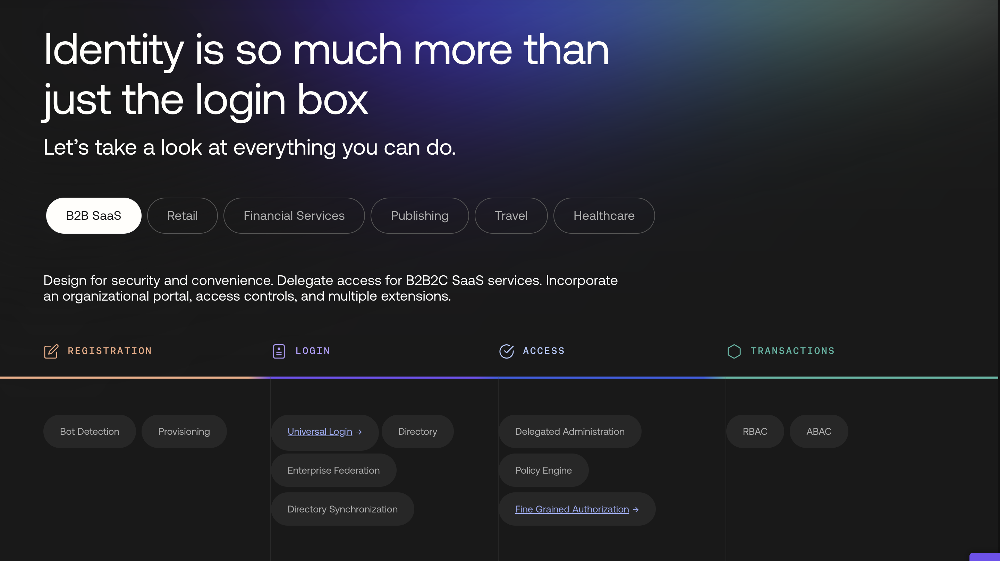

# STOADO ONBOARDING TEST

This is an onboarding test done for Stoado. It replicates the feature section from the following url: [Auth0.com](https://auth0.com/)
This section is fully functional as it is on the reference website.

This is this section that this repository trying to replicate

## Steps to run the code

1. run `npm i` in the root folder. This installs all the dependancies.
2. run `npm run dev` to start the development server.

### Tech Stack

- React
- Typescript
- Vite
- Tailwind css
